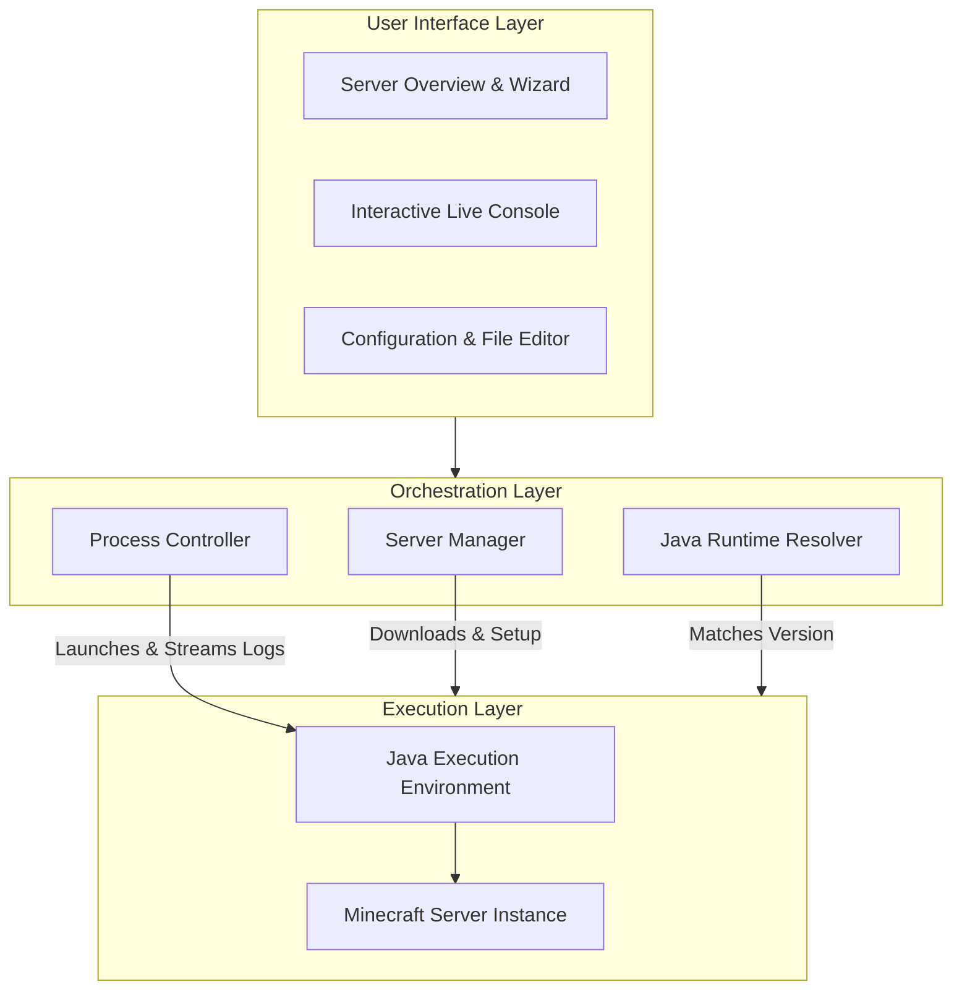
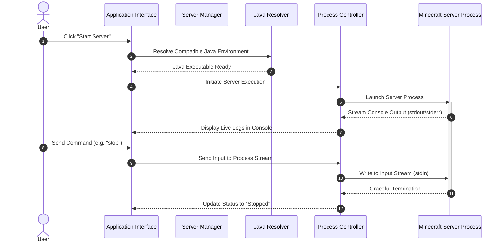

# 🎮 PocketHost Desktop

An intuitive Windows desktop application designed for seamlessly managing local Minecraft servers. **PocketHost Desktop** provides a clean graphical interface to create, configure, launch, and monitor servers across various mod loaders without manual command-line setup.

---

## 💡 What it Does & Why Use It

Setting up and managing dedicated Minecraft servers locally often requires dealing with terminal windows, command-line arguments, port conflicts, manual Java version matching, and complex configuration files.

**PocketHost Desktop** simplifies this into a unified management hub:

- **Multi-Loader Support:** Deploy servers using Vanilla, PaperMC, Purpur, Fabric, Spigot, Bukkit, Forge, or NeoForge.
- **Automated Downloads:** Instantly fetch required server binaries and matching Java execution environments.
- **Live Server Console:** Real-time terminal output with direct command input support.
- **Built-in Configuration Editor:** Modify server configuration files directly from within the application interface.
- **Port Collision Prevention:** Automatic port scanning to prevent network binding errors.
- **Process Protection:** Safe server start, graceful shutdown handling, and process status tracking.

---

## 🔄 Principle of Operation

PocketHost Desktop orchestrates the complete lifecycle of a Minecraft server through four main layers: user interaction, core orchestration services, execution management, and data persistence.

### Architecture Overview



### Execution & Control Workflow

When a user interacts with a server, the system executes the following operational pipeline:



---

## 🛠️ How it Works under the Hood

1. **Server Provisioning:**
   - Automatically queries official release feeds to obtain download links for server JARs.
   - Generates essential environment files (such as `eula.txt` and `server.properties`) automatically upon server creation.

2. **Environment & Runtime Management:**
   - Detects the Minecraft version of the selected server and automatically provisions a matching, compatible Java runtime environment if one is not present.

3. **Process Supervision & IO Handling:**
   - Launches server instances in isolated sub-processes.
   - Captures console output streams asynchronously and pipes them directly to the user interface.
   - Provides a direct input pipeline to pass commands into the live running server process.

4. **Network Guard:**
   - Verifies local network socket availability before starting a server to ensure selected ports are free.

---

## 📂 Project Structure

```
PocketHost-pc-port/
├── common/             # Core models, database schema, repository & utilities
│   └── src/
│       ├── commonMain/ # Cross-platform declarations & schemas
│       └── jvmMain/    # Core data repositories, networking, and file handlers
├── desktop/            # Desktop application & system execution logic
│   └── src/
│       └── main/
│           ├── kotlin/ # User Interface screens, widgets, & process controllers
│           └── resources/# Application icons, themes, and visual assets
├── build.gradle.kts    # Build setup and dependency management
└── settings.gradle.kts # Project module declarations
```

---

## 🚀 How to Run & Launch

### Prerequisites
- **Operating System:** Windows 10 or Windows 11 (64-bit).
- **Installed JDK:** JDK 17 or higher.

---

### Option 1: Running from Source
Use the included Gradle wrapper to launch the application directly:

```powershell
# Launch application UI
.\gradlew :desktop:run
```

---

### Option 2: Building Standalone Executables

#### Portable Executable Application
Generates a self-contained application folder:
```powershell
.\gradlew :desktop:createDistributable
```
*Launch via executable:* `desktop/build/compose/binaries/main/app/PocketHost/PocketHost.exe`

#### Single Portable Jar
Builds a standalone executable JAR file:
```powershell
.\gradlew :desktop:packageUberJarForCurrentOS
```
*Run via java command:*
```powershell
java -jar desktop/build/compose/jars/PocketHost-windows-x64-1.0.0.jar
```

#### Windows Installer Package
Creates an executable Windows installer package (`.msi`):
```powershell
.\gradlew :desktop:packageMsi
```

---

## 🗺️ Roadmap

- [ ] **System Tray Minimization:** Keep servers running silently in the background.
- [ ] **Automated Backups:** One-click scheduled snapshots of server worlds.
- [ ] **Containerization Support:** Linux server execution via Docker or WSL2.
- [ ] **Performance Analytics:** Visual graphs for real-time CPU and RAM monitoring.

---

## 📄 License

This project is open-source and provided under the [MIT License](LICENSE).
